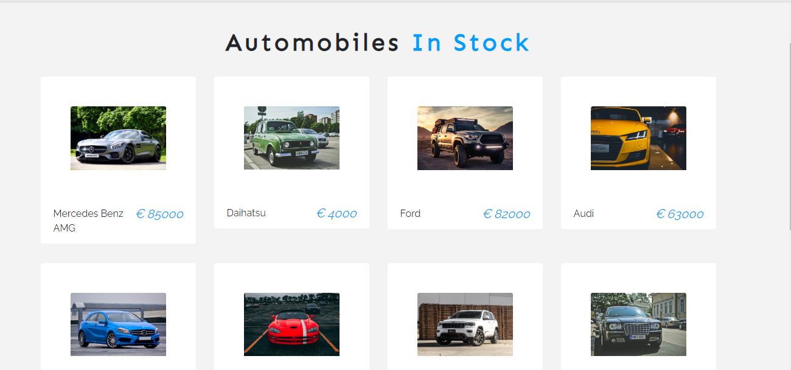

# Project Name

> Car Shop

## Table of contents

- [General info](#general-info)
- [Technologies](#technologies)
- [Setup](#setup)
- [Status](#status)
- [How to improve the project](#how-to-improve-the-project)
- [Contact](#contact)

## General info

eCommerce website built using ReactJS. React’s Context API was used for state management. Styled components, CSS & bootstrap were used for styling. And paypal express checkout was also integrated as a payment option

## Technologies

- @testing-library/jest-dom - version 4.2.4
- @testing-library/react- version 9.5.0
- @testing-library/user-event - version 7.2.1
- bootstrap - version 4.4.1
- react-scripts - version 3.4.0
- react-paypal-express-checkout - version 1.0.5
- react - version 16.13.1
- react-dom - version 16.13.1
- styled-components - version 5.0.1
- context API

## Setup

IDE used was Visual Studio Code. The application can run locally on localhost 3000. It is also currently deployed on heroku https://buy-automobile.herokuapp.com/
All necessary dependencies were installed, as seen in package.json

## Status

Project is:completed

## How to improve the project

- Star this repository
- Fork this repository
- Open any of the Javascriit file and add the explanation of any line of code as a comment line
- Commit changes with a meaningful commit message
- Create a pull request.
- Relax while your pull request is reviewed and merged.

## Contact

Created by [@ogbeche77](https://github.com/ogbeche77)
